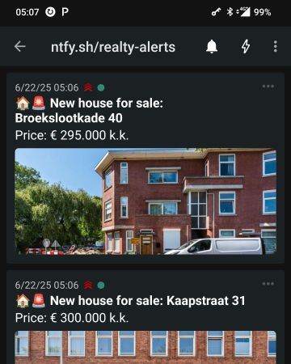

<p align="center">
  <br/>
  <a href="https://www.python.org">
    
  </a>
  <a href="https://docs.celeryq.dev/en/stable/getting-started/introduction.html">
    
  </a>
  <a href="https://docs.pydantic.dev/latest/">
    
  </a>
  <a href="https://sqlite.org">
    
  </a>
  <a href="https://playwright.dev/python/">
    
  </a>
  <a href="https://docs.docker.com/compose/">
    
  </a>
  <br/>
  <br/>
</p>

# Realty Alerts

Realty Alerts is a simple alerting tool for notifying when new homes become available for purchase on Dutch real estate websites, such as Funda.nl.

<div align="center">
    
</div>

## Key Features

- Queries for each website can be added with simple YAML files, including their scheduling.
- Notifications can be received through NTFY (app available on Android/iOS)
- Only new house offers will be notified. The ones that already have been notified won't repeat again.
- Deployment of the whole tool can be easily done with a docker compose file.

## Supported Websites

- Funda: https://www.funda.nl
- Pararius: https://www.pararius.nl
- Vastgoed Nederland: https://aanbod.vastgoednederland.nl

> [!NOTE]
> Only the list of websites above is currently available for scraping. Other websites (e.g. of real estate brokers) will be supported on request (Github issue).


## App setup

1. Download the NTFY app from the [play store](https://play.google.com/store/apps/details?id=io.heckel.ntfy) (Android) or from the [app store](https://apps.apple.com/us/app/ntfy/id1625396347) (iOS)
2. Click on the plus icon to add a new topic. Write a creative one, to avoid other people pushing to your topic. All topics on the `https://ntfy.sh` server are public, so if you wish, you can also use your own NTFY server for more privacy. If doing so, please check the following [link](https://docs.ntfy.sh/install/), and don't forget to add the [environment variable](#additional-configuration) `NTFY_URL` in the docker compose file.


## How to use

1. Check if docker is installed. If not, follow the guidelines in the [official website](https://docs.docker.com/engine/install/).
2. Copy the `docker-compose.yml` file from this repo.
3. Create a `queries` folder. This will contain all the yml files with your preffered queries.
4. Inside the `queries` folder, create a new yml file. It's contents should look like this:

```yml
name: "Funda: 2521CC 5km radius"  # Name of the query. Don't repeat the same name for different query files.
ntfy_topic: realty-alerts  # Use the same topic as used in the app.
cron_schedule: "0 9,15 * * 1-5"  # A cron expression, for scheduling the query. Check https://crontab.guru for help.
query_url: https://www.funda.nl/zoeken/koop?selected_area=%5B%222521cc,10km%22%5D  # The query you're interested in.
max_listing_page_number: 3  # Optional. This is to avoid excessive scraping, which can result in website blocks.
notify_if_no_new_listing: false  # Optional. Alerts when there are no new query results.
```

5. If you want more queries, just create a new yml file and put it in the `queries` folder.
6. Check if the `queries` folder is in the same location as the docker compose file (volumes) expects. If not, update the volume path in the docker compose file
7. If needed, configure any environment variables in the docker compose file. Please check [below](#additional-configuration)
8. Run the command:

```bash
docker compose up -d
```

9. Everything is set! You will receive a notification per query in the app confirming that everything works as expected. If not so, please check the docker compose logs.

## Additional configuration

Realty Alerts can be run as is, without any additional configuration. But in case needed, environment variables can be set. Here is a list of them and their default values:

| Env variable | Default value                 |
| ------------ | ----------------------------- |
| NTFY_URL     | https://ntfy.sh               |
| REDIS_URL    | redis://localhost:6379/0      |
| TIMEZONE     | Europe/Amsterdam              |
